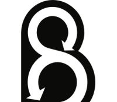

<table align="center">
    <tr style="text-align: center;">
        <td align="center" width="9999">
            
            

 <h1 style="color: black;">Laravel Behat Extension</h1>

<p style="color: black">A powerfully extension to integrate laravel with behat from scratch and start writing great feature histories.</p>
</td>
</tr>
</table>

# Getting started

## 1. Install Dependencies

As always, we need to pull in some dependencies through Composer.

```shell
composer require behat/behat behat/mink friends-of-behat/mink-extension soulcodex/laravel-behat --dev
```

This will give us access to Behat, Mink, and, of course, the Laravel extension.

## 2. Create the Behat.yml Configuration File

Next, within your project root, create a `behat.yml` file, and add:

```yaml
default:
    extensions:
        Soulcodex\Behat:
            kernel: # Default values
                bootstrap_path: '/bootstrap/app.php'
                environment_path: '.env.behat'
        Behat\MinkExtension: # Default mink extension configuration
            default_session: laravel
            laravel: ~

    # Your test suites here
    suites:
        user:
            paths: [ '%paths.base%/path/to/your/features/tests/files' ]
            # The context needed by your features tests
            contexts: ~
```

Here, is where we reference the Laravel extension, and tell Behat to use it as our default session. You may pass an
optional parameter, `env_path` (currently commented out above) to specify the name of the environment file that should
be referenced from your tests. By default, it'll look for a `.env.behat` file.

This file should, like the standard `.env` file in your project root, contain any special environment variables
for your tests (such as a special acceptance test-specific database).

## 3. Setting up a new context

Create a new one context in the directory specified in the `paths` configuration property **using**
[the base context](src/Addon/Context.php) and register the [RootContext class](src/Addon/RootContext.php) like this:

_behat.yaml_

```yaml
suites:
    user:
        paths: [ '%paths.base%/app/User/Test/Feature/' ]
        # The context needed by your features tests
        contexts:
            -   Soulcodex\Behat\Addon\RootContext: ~
            -   App\User\Test\Feature\UserContext:
                    userRepository: '@App\User\Infrastructure\Persistence\Eloquent\EloquentMySqlUserRepository'
```

_app/User/Test/Feature/UserContext.php_

```php
<?php

declare(strict_types=1);

namespace App\User\Test\Feature;

use App\User\Domain\UserRepository;
use Soulcodex\Behat\Addon\Context;

final class UserContext extends Context
{
    public function __construct(private UserRepository $userRepository)
    {
    }

    /**
     * @Given I send a request to :url
     */
    public function iSendARequestTo(string $url): void
    {
        $this->visitUrl($url); // Perform an action using the mink session 
    }
}
```

Note: Its recommended use from time been 

Start writing your features test with Behat. ¡Happy coding!

## Features 🎁

#### 💫 Plug & Play philosophy, just create you context, extends from [base context](src/Addon/Context.php) and start your feature context.

```php
<?php

use Soulcodex\Behat\Addon\Context;

final class MyMarvelousContext extends Context
{
    /**
     * @Given I do a marvelous action in my application
     */
    public function iDoAMarvelousActionInMyApp(): void
    {
        $this->doMarvelousThings();
    }
}
```

#### 💫 Direct access to mink session and shortcut to perform `GET` request to specific url

```php
$this->visitUrl($url); // Perform GET request to specific URI
$this->session(); // Access to the mink session to perform actions
```

#### 💫 Runtime access to the container to get dependencies or do anything

```php
$this->container(); // Get laravel application container access
```

#### 💫 PHPUnit assertions from your context

```php
$this->assertSame(...);
$this->assertEquals(...);
$this->assertInstanceOf(...);
```

## FAQ ❓

### Will be released new functionalities ?

Yes, of course but i need help and support in order to maintain and upscale the package according this bullet points:

* Transform this package in more than a simple behat setup package.
* Improve and make easier the developer life working in favor of *Plug & Play* philosophy.
* Push in favor of BDD pattern as great way/approach to have aligned business and technical layers.

### Could be possible contribute to help and maintain this package?

Yes, contact with me through [email](mailto:robertojosegn55@gmail.com) with subject `Behat Extension - Contributor` and
send me the following data:

* Full name 👋
* GitHub link 💡 :octocat:
* LinkedIn to connect 😁
* The most important thing ➡️ **ideas** 💡

### I'm getting a "PHP Fatal error: Maximum function nesting level of '100' reached, aborting!" error.

Sounds like you're using
Xdebug. [Increase the max nesting level](http://xdebug.org/docs/all_settings#max_nesting_level).

## How contribute / things pending to do 📄

- [X] Implement a good and readable CHANGELOG using
  this [library](https://github.com/marcocesarato/php-conventional-changelog) or another one.
- [ ] Add test coverage for all laravel version matrix using GitHub Actions.
- [ ] Automatize test and package release to packagist.
- [ ] Add usefully traits to give `Plug & Play` tools. **⏱ _in progress_**
- [ ] Add `mode` to configuration to let choose between `KernelBrowser (default)` or `SeleniumBrowser` implementation.
- [ ] Create or amplify a base context for `api` and `web` approaches.